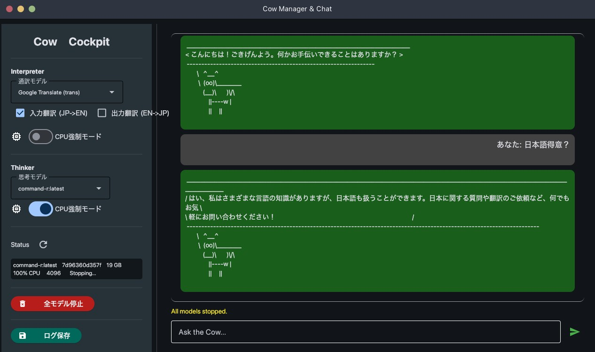

# Moorchestration-Ollama (Cow Manager)

Locally hosted LLM manager with Python (Flet) UI and Go backend.



## Features
- **Hybrid Architecture:** Python frontend + Go backend.
- **Resource Management:** CPU/GPU switching for LoRA training co-existence.
- **Local Translator:** Privacy-focused translation layer.

## Requirements
- Ollama
- Go (for building backend)
- Python 3.10+

## Setup
```bash
go build -o cow-manager main.go
pip install -r requirements.txt
python3 cow_chat.py
```